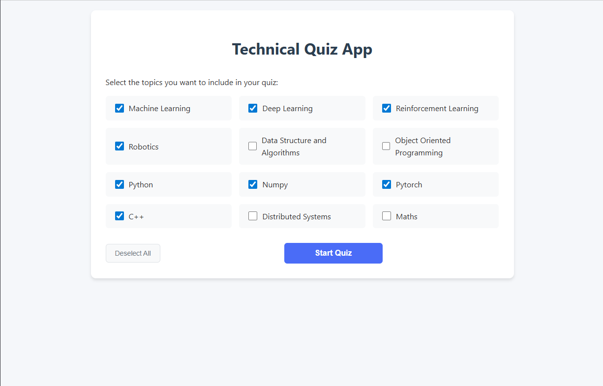
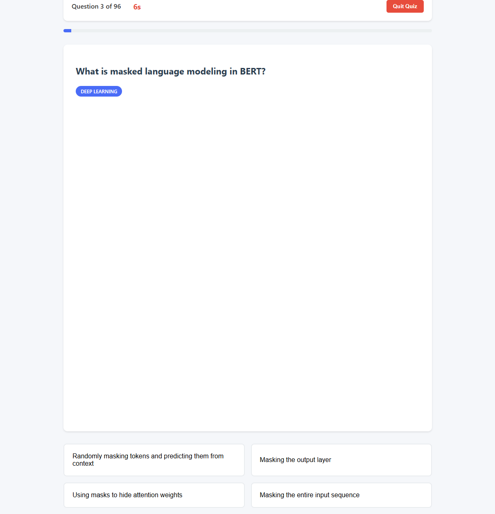
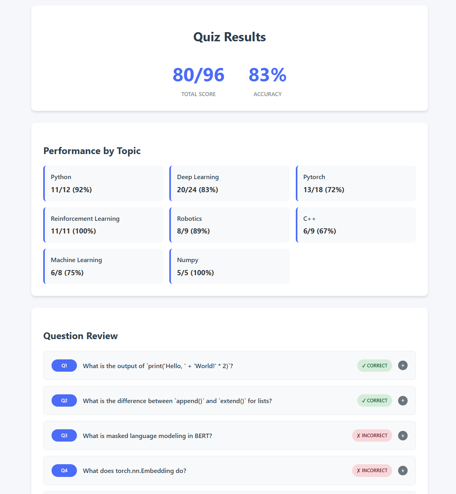
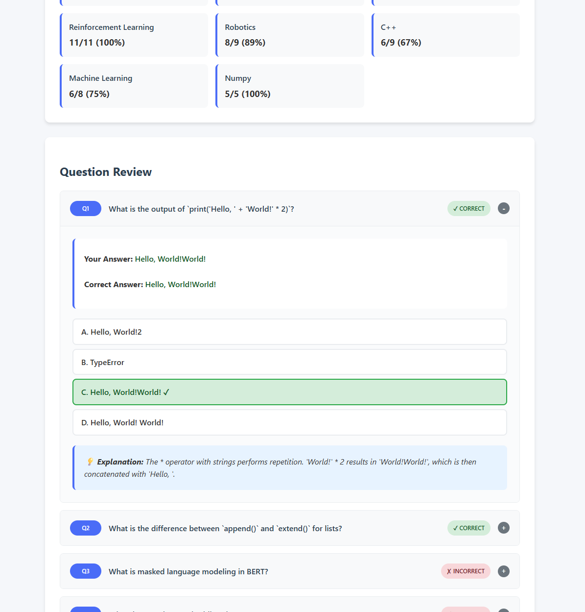

# Technical Quiz Application

Most of this README was generated by the Windsurf SWE-1 AI agent. Inspired by a recent interview I had, I thought this would be a nice way to quickly review technical knowledge during commute or whenever I have some time to spare. I was super curious and wanted to try out AI assistive coding. AI coding agents are powerful tools that can help quickly turn ideas into working prototypes. However, during the development of this reletively simple application I found that the agents still suffered from hallucinations and were not as good at long term planning and comparing trade-offs. I found that it was still important to be able to understand, manually review and debug the code. I mainly used the Claude Sonnet 4 agent for developing this application.

A comprehensive technical quiz application designed to test knowledge across various computer science and programming topics. The app features a clean, user-friendly interface with multiple-choice questions and detailed performance analysis.

## Features

- **Multiple Topics**: Choose from 12+ technical topics including:
  - Machine Learning
  - Deep Learning
  - Reinforcement Learning
  - Robotics
  - Data Structures & Algorithms
  - Object-Oriented Programming
  - Python
  - NumPy
  - PyTorch
  - C++
  - Distributed Systems
  - Mathematics

- **Customizable Quizzes**:
  - Select specific topics to include
  - Toggle between different difficulty levels
  - 96 total questions available

- **Interactive Interface**:
  - Clean, responsive design
  - Progress tracking
  - Timer for each question (15-25 seconds based on difficulty)

- **Comprehensive Results**:
  - Total score out of 96
  - Performance breakdown by category
  - Detailed question review
  - Correct answers with explanations

## Screenshots

### Home Screen

*Select topics for your quiz from the available options*

### Quiz Interface

*Answer multiple-choice questions with a timer*

### Results Page


*View your score and performance breakdown*

## How to Run

### Prerequisites
- Modern web browser (Chrome, Firefox, Safari, or Edge)
- Python installation

### Running the Application
1. Clone or download this repository
2. Open this repository or project folder in terminal
3. Start a local python server using:
```bash
python -m http.server 8000
```
4. Open your browser and enter the following URL:
```
http://localhost:8000
```
3. Select the topics you want to include in your quiz
4. Click "Start Quiz" to begin

## Project Structure

```
Job_Quiz_App/
├── index.html          # Main entry point
├── quiz.html           # Quiz interface
├── results.html        # Results page
├── app.js              # Main application logic
├── quiz.js             # Quiz functionality
├── results.js          # Results processing
├── styles.css          # Main styles
├── quiz-styles.css     # Quiz page styles
├── results-styles.css  # Results page styles
└── *.json              # Question banks for each topic
```

## Question Format

Questions are stored in JSON files for each topic, following this structure:

```json
{
  "questions": [
    {
      "question": "What is the time complexity of binary search?",
      "options": [
        "O(1)",
        "O(log n)",
        "O(n)",
        "O(n²)"
      ],
      "correctAnswer": 1,
      "explanation": "Binary search has a time complexity of O(log n) as it halves the search space in each iteration.",
      "difficulty": "easy"
    }
  ]
}
```

## Customization

### Adding New Questions
#### Adding Manually
1. Open the corresponding JSON file for the topic
2. Add a new question object to the `questions` array
3. Follow the existing format for questions, options, and explanations

#### Adding Using AI Agent
I used the Claude Sonnet 4 AI agent to search the web and add new questions for different topics. The AI agent maintains a context file to keep track of the questions it has already added and assist it in finding new questions.

### Styling
Modify the CSS files to customize the appearance:
- `styles.css` - Main application styles
- `quiz-styles.css` - Quiz page specific styles
- `results-styles.css` - Results page specific styles
